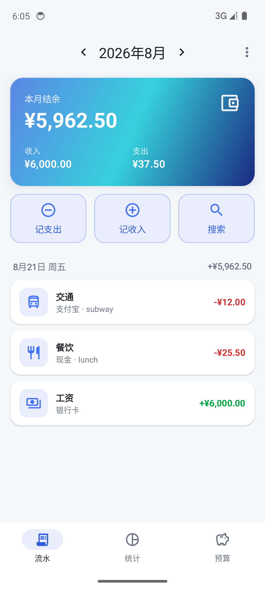
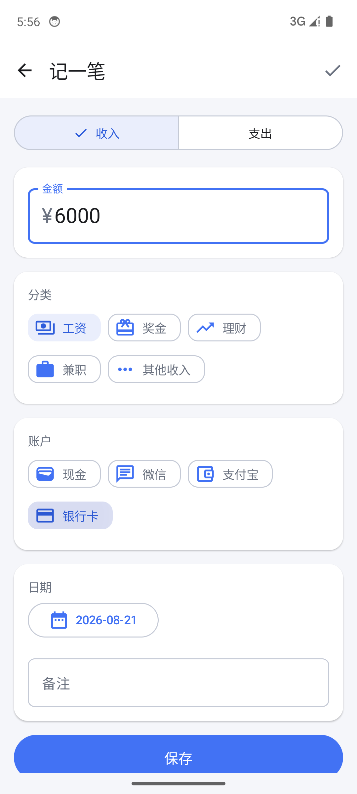
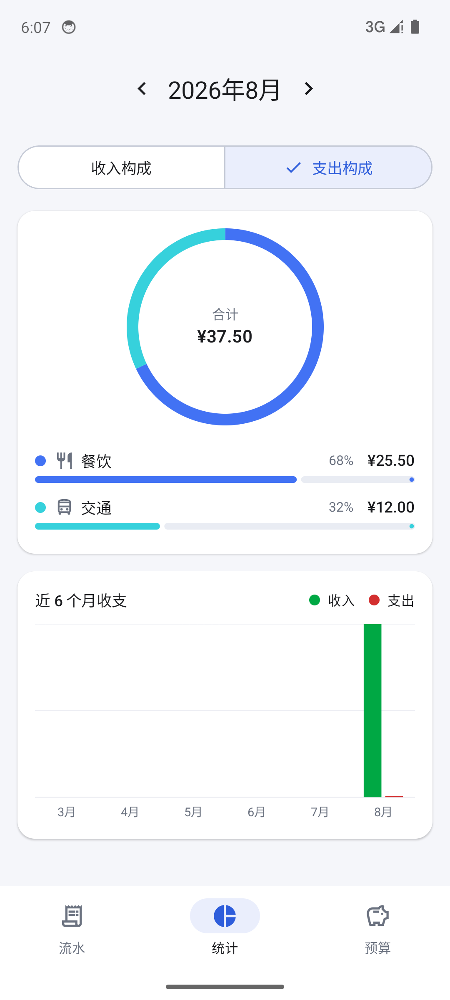
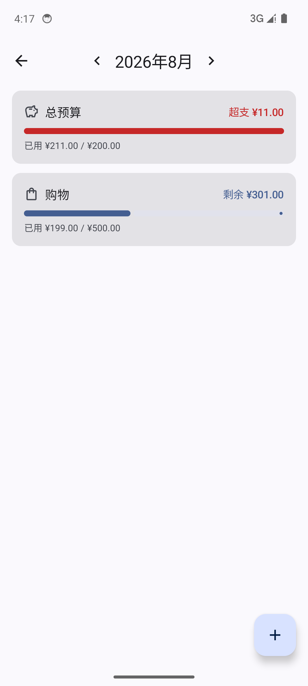
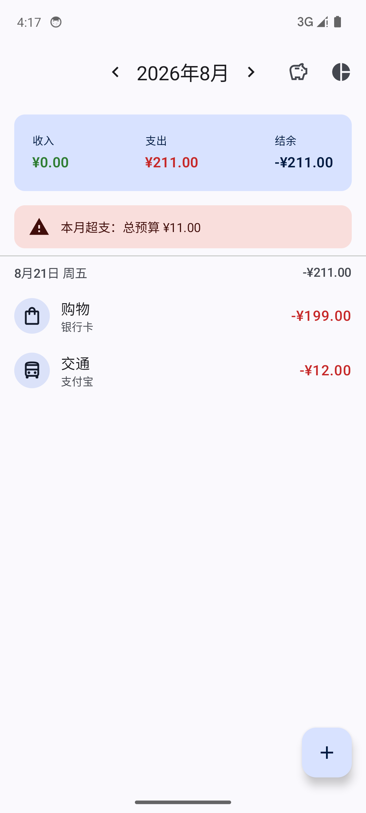
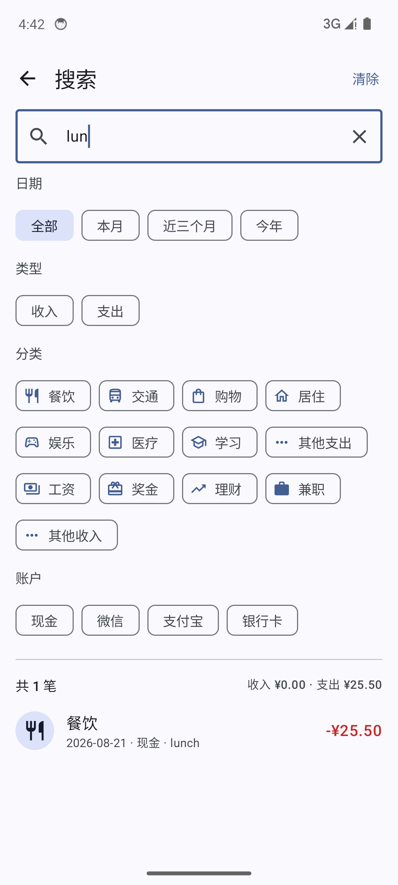
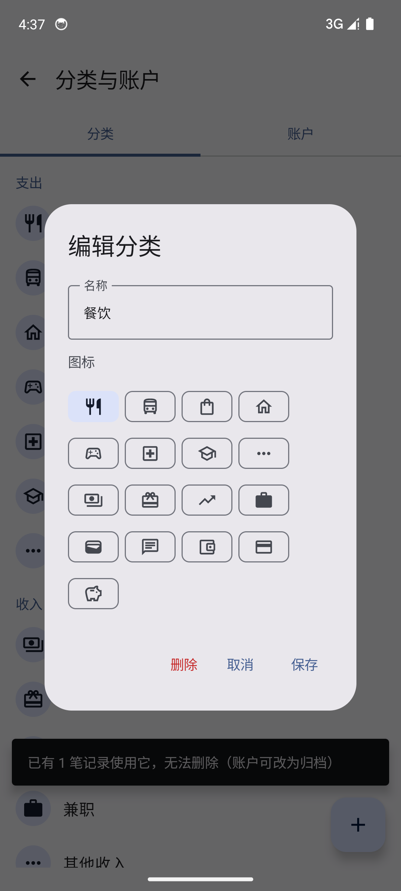
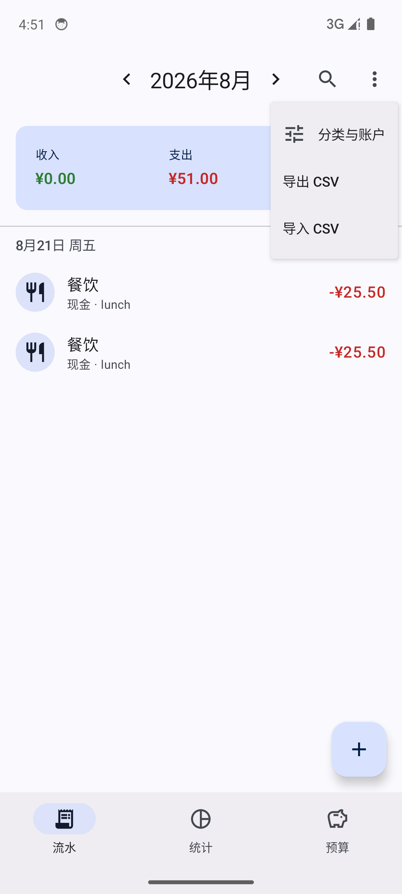

# 记账本（ledger）

一个用现代 Android 技术栈从零重写的个人记账 App，课程设计项目。
架构与工程实践参照 [android/architecture-samples](https://github.com/android/architecture-samples)，数据建模参照 [Ivy Wallet](https://github.com/Ivy-Apps/ivy-wallet) 的指南。

## 截图
| 流水 | 记一笔 | 统计 | 预算 |
|---|---|---|---|
|  |  |  |  |

| 超支提醒 | 搜索 | 分类管理 | 导入导出 |
|---|---|---|---|
|  |  |  |  |

## 技术栈
Kotlin 2.1 · Jetpack Compose (Material 3) · Hilt · Room · Coroutines/Flow · Navigation Compose · JUnit4/Truth · Compose UI Test · GitHub Actions

## 架构（单模块，按包分层，依赖只能向下）
```
ui/        Compose 屏幕 + ViewModel（每屏一个 UiState，单向数据流）
  transactions/   流水列表 + 月度概览 + 超支横幅（底部导航 Tab 1）
  statistics/     分类占比环形图 + 6 个月趋势（Tab 2）
  budget/         预算列表与设置（Tab 3）
  addedit/        记一笔 / 编辑
  search/         搜索与筛选
  manage/         分类与账户管理
  datatransfer/   CSV 导出 / 导入（SAF）
  navigation/     单 Activity + NavHost + 底部导航栏
domain/    纯 Kotlin，不依赖 Android
  model/          Money(分) / Transaction / Category / Account
  logic/          月度汇总、月份区间等纯函数
data/      TransactionRepository 等接口 + Room 实现（实体与领域模型分离）
di/        Hilt 模块
```
数据流：Room DAO 返回 `Flow` → Repository 映射成领域模型 → ViewModel `combine` 成 `StateFlow<UiState>` → Compose 订阅。
任何写入都会自动刷新所有订阅页面，不存在"返回时手动重载"。

## 关键设计决策
- 金额用 `value class Money(cents: Long)`，杜绝浮点误差；时间用 `Instant`，显示时按时区转本地日期。
- 所有实体用 UUID 主键；分类、账户是独立实体（内置数据首次启动写入）。
- 记账允许支出大于收入——记账本记录事实，不是银行。
- Room `exportSchema=true`，schema JSON 进仓库，为将来迁移做准备。

## 运行
```bash
export ANDROID_HOME=~/Android/Sdk JAVA_HOME=~/.jdks/jdk-17.0.20+8
./gradlew assembleDebug            # 编译
./gradlew testDebugUnitTest          # 66 个 JVM 单测（领域逻辑 + ViewModel，Fake 仓库）
./gradlew connectedDebugAndroidTest  # 15 个仪器测试：Room DAO/迁移 + Compose UI 端到端（Hilt 测试替身 + 内存库；需模拟器/真机）
```

## 许可
MIT

## 路线图
- [x] MVP：记一笔 / 流水按日分组 / 月度收支结余 / 编辑删除
- [x] 统计页：分类占比环形图 + 排行、近 6 个月收支趋势
- [x] 预算（按月、总预算或按分类）+ 流水页超支横幅；Room v1→v2 自动迁移 + 迁移测试
- [x] 分类 / 账户管理：新增、改名换图标、删除（被流水引用时拦截并提示）、账户归档
- [x] 搜索与筛选：关键词（备注/分类名）× 类型 × 分类 × 账户 × 时间预设，结果带收支汇总
- [x] Compose UI 测试：记一笔端到端、校验提示、底部导航/菜单导航（HiltTestRunner + @TestInstallIn 内存库）
- [x] 视觉重设计：参考原项目的蓝色主题 / 渐变结余卡 / 快捷按钮 / 白卡片条目
- [x] CSV 导出 / 导入（系统文件选择器；导入按名称匹配分类/账户，缺失自动创建，坏行逐条报告）
